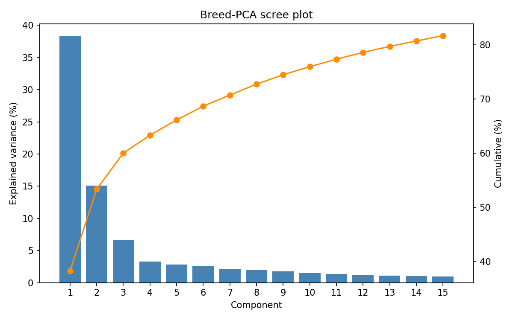
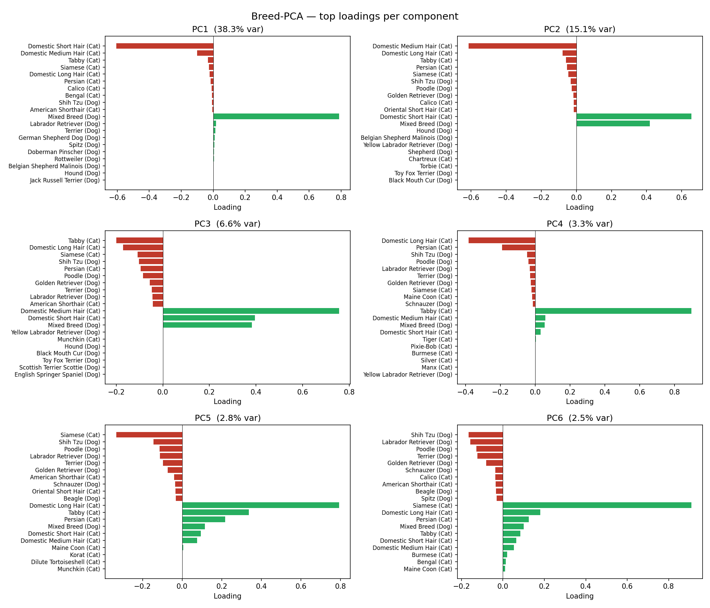
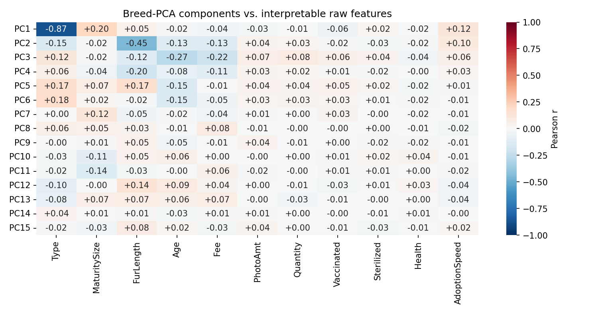

# Changelog

## Session 1: 15.05

- "Start small, go bigger later"
  - Only Dog/Cats first
  - Use Tabular Data first (and maybe the metadatas and senitments), use images later
  - Start off with Random Forest Classificiation Models

## Session 2: 22.05

- Maybe try without the breed, the amount of information in this might be highly limited a
- Use only dogs (reduce training set), use only tabular and try to get higher accuracy and keep optimizing the random forest (500 too many trees)
- Compress vector (reduce feature vector), get an embedding out of the feature vector
  - embedd breeds into own dense vector (auto encoder for breed?, dimensionality reduction (PCA))
- Go ahead and try using images/more advanced classifier

## 05.06.2026

1. Try LGBM instead of Random Forest

- better with large / sparse feature vectors
- hyperparameter optimization with optuna
  - num_leaves = 30, max_depth = 5 -> looks like stable result in tuning process
- 2000 boosting rounds with 100 round early stopping
  - training process early stopped after ~700 rounds -> convergence?
  - result: QWK goes from 0.33 to 0.37

2. Apply PCA to breed vector

- 307 one hot encoded cols -> 15 cols (80% explained variance)
- tested with 80% to 95% explained variance -> 80% yielded best results in training
  - results:
    - LGBM only jumps up to QWK 0.375
    - Random Forest improves more: 0.33 -> 0.357

### TODOs

- instead of pca, maybe use target encoding with average adoption probability of breed per class (if training data is sufficient -> investigate)
- use smaller dataset for training first (only dogs)
- improve random forest implementation
- Use image embedding in addition to tabular data !!!

### Feedback

- simpler approach, simplify dataset (only dog, isolate certain output classes)
- take look at pca vector, if we can classify breeds from that (cat vs. dog)
- get more data understanding
- promising result first: ~80% precision

## 12.06.2026

1. simpler approach & simplify dataset

- tested with binary output classes and only dogs / cats for simplicity
- same day vs. 100+ day yielded "best" result, but only due to high imbalance in classes
- in general: results get worse, if classes are closer
- no "perfect" model archieved

2. pca analysis

- Since there are always just a maximum of 2 breeds, there are not many semantic correlations
- Most Breeds have almost zero values in most PCs

3. image embeddings

### Our straw plan

- Overwrite/dismiss all 0 into 1 -> class 0 is so drastically underrepresented, it cannot be predicted and has precision of around 3% (catastrophically)
- last straws -> Run embeddings with resNet and effiencnet (often used in the competition), try out different PCA component sizes and run with tune for all of the configs
  Pca component size 64 -> 16 -> 0 (0 must then just be ran with --tune 50 and for the new class mode without the 0 class)

## For last Session: 19.06. Updates

- Last tests were run to determine whether the class imbalance could be addressed
  - Using custom weight for class 0 (in span of 0 - 20 in hyper parameter tuning)
  - Using SMOTE to synthetically boost class 0
- Results yielded:
  - Using custom weight balances: QWK: 0.3945 on training, 0.342 on test
  - Using SMOTE: QWK: 0.3961 on training, 0.3495 on test (best score yet)
- Lastly, we updated and sorted the files, documentation and soure code as finalization
