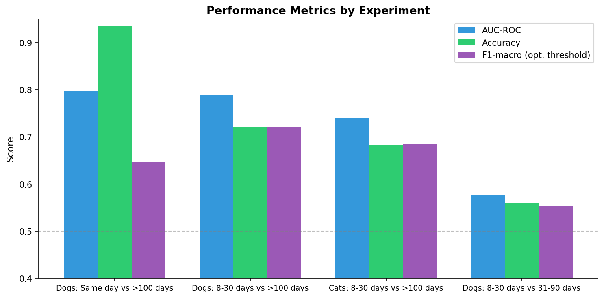
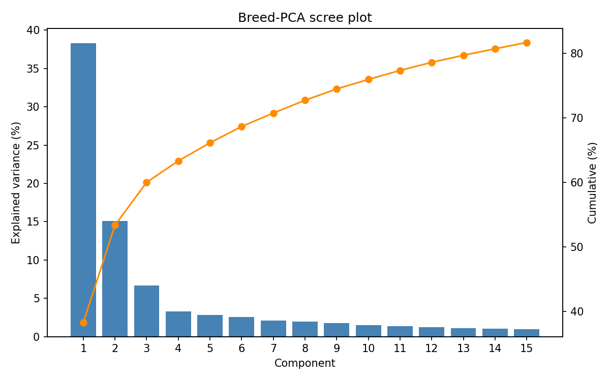
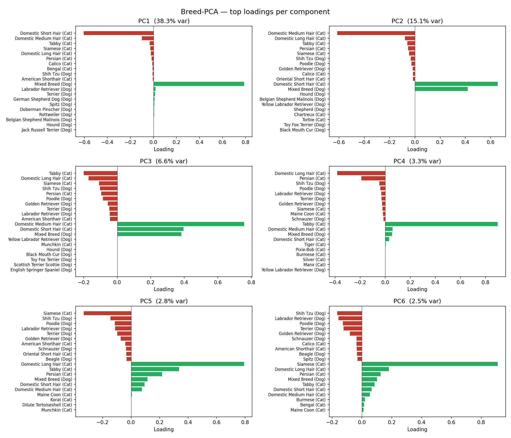
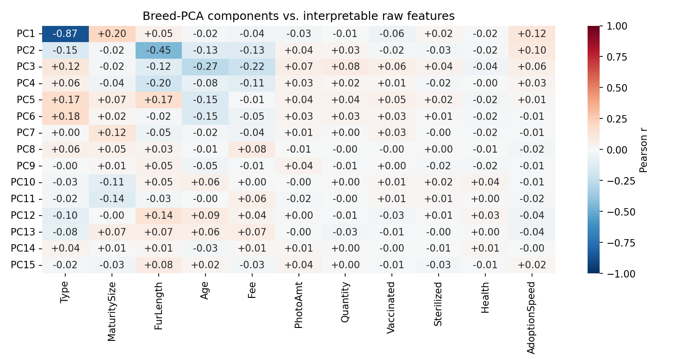

# Changelog

## Session 1: 15.05

- "Start small, go bigger later"
  - Only Dog/Cats first
  - Use Tabular Data first (and maybe the metadatas and senitments), use images later
  - Start off with Random Forest Classificiation Models

## Session 2: 22.05

- Maybe try without the breed, the amount of information in this might be highly limited a
- Use only dogs (reduce training set), use only tabular and try to get higher accuracy and keep optimizing the random forest (500 too many trees)
- Compress vector (reduce feature vector), get an embedding out of the feature vector
  - embedd breeds into own dense vector (auto encoder for breed?, dimensionality reduction (PCA))
- Go ahead and try using images/more advanced classifier

## 05.06.2026

1. Try LGBM instead of Random Forest

- better with large / sparse feature vectors
- hyperparameter optimization with optuna
  - num_leaves = 30, max_depth = 5 -> looks like stable result in tuning process
- 2000 boosting rounds with 100 round early stopping
  - training process early stopped after ~700 rounds -> convergence?
  - result: QWK goes from 0.33 to 0.37

2. Apply PCA to breed vector

- 307 one hot encoded cols -> 15 cols (80% explained variance)
- tested with 80% to 95% explained variance -> 80% yielded best results in training
  - results:
    - LGBM only jumps up to QWK 0.375
    - Random Forest improves more: 0.33 -> 0.357

### TODOs

- instead of pca, maybe use target encoding with average adoption probability of breed per class (if training data is sufficient -> investigate)
- use smaller dataset for training first (only dogs)
- improve random forest implementation
- Use image embedding in addition to tabular data !!!

### Feedback

- simpler approach, simplify dataset (only dog, isolate certain output classes)
- take look at pca vector, if we can classify breeds from that (cat vs. dog)
- get more data understanding
- promising result first: ~80% precision

## 12.06.2026

1. simpler approach & simplify dataset


- tested with binary output classes and only dogs / cats for simplicity
- same day vs. 100+ day yielded "best" result, but only due to high imbalance in classes
- in general: results get worse, if classes are closer
- no "perfect" model archieved

2. pca analysis





- Since there are always just a maximum of 2 breeds, there are not many semantic correlations
- Most Breeds have almost zero values in most PCs

3. image embeddings

### Our straw plan

- Overwrite/dismiss all 0 into 1 -> class 0 is so drastically underrepresented, it cannot be predicted and has precision of around 3% (catastrophically)
- last straws -> Run embeddings with resNet and effiencnet (often used in the competition), try out different PCA component sizes and run with tune for all of the configs
  Pca component size 64 -> 16 -> 0 (0 must then just be ran with --tune 50 and for the new class mode without the 0 class)

## For last Session: 19.06. Updates

- Last tests were run to determine whether the class imbalance could be addressed
  - Using custom weight for class 0 (in span of 0 - 20 in hyper parameter tuning)
  - Using SMOTE to synthetically boost class 0
- Results yielded:
  - Using custom weight balances: QWK: 0.3945 on training, 0.342 on test
  - Using SMOTE: QWK: 0.3961 on training, 0.3495 on test (best score yet)
- Lastly, we updated and sorted the files, documentation and soure code as finalization

## 08.07.2026 — Model evaluation workflow

Added a new `src/evaluation/` package plus `evaluation_main.py` that trains
and benchmarks 7 model configurations on a single shared stratified train/val
split so their metrics are directly comparable.

**Models trained:**

1. Random Forest — OHE raw, default params
2. Random Forest — OHE raw, tuned (Optuna)
3. LightGBM     — OHE raw, tuned
4. Random Forest — Breed-PCA, tuned
5. LightGBM     — Breed-PCA, tuned
6. LightGBM     — Image embeddings PCA-64, tuned
7. LightGBM     — Image embeddings PCA-64 + SMOTE, tuned

**Recomputed from scratch on every run** (for comparable training times):
image embeddings, preprocessing parquets, and hyperparameter tuning.

**Recorded per model:** accuracy, QWK, F1 (macro/weighted), precision/recall
(macro), training time, tuning time, inference time (total + ms/sample),
model size on disk, feature count, sample counts, hyperparameters, hostname.

**Outputs** live under `results/<timestamp>[_<tag>]/`:

- `metrics/*.json` — one JSON per model (machine-independent, mergeable)
- `tuning_logs/*.json` — full Optuna trial history per tuned model
- `visualizations/` — QWK+Accuracy bar chart, QWK vs Accuracy scatter,
  training-time bar (log scale), inference-time bar, tuning-time bar,
  `metrics_summary.csv`
- `run_config.json`, `split_indices.npz`, `merged_results.csv`

**Multi-machine support:** each machine writes to its own timestamped
directory. Merging is done via
`python -m src.evaluation.merge_results --results-dir results` which
recursively collects all `metrics/*.json` files and rebuilds the plots
+ `merged_results.csv` under `results/_merged/`.

**Usage:**

```bash
# Everything on one machine
python evaluation_main.py --n-trials 50 --run-tag desktop

# Split across two machines
python evaluation_main.py --run-tag machineA \
    --only model_1_rf_ohe_default --only model_2_rf_ohe_tuned \
    --only model_3_lgbm_ohe_tuned --only model_4_rf_breedpca_tuned \
    --only model_5_lgbm_breedpca_tuned
python evaluation_main.py --run-tag machineB \
    --only model_6_lgbm_embeddings_tuned \
    --only model_7_lgbm_embeddings_smote_tuned

# Merge & plot combined
python -m src.evaluation.merge_results --results-dir results
```

### Refactor — reuse existing implementations

The initial version of `src/evaluation/trainers.py` implemented its own
Random Forest / LightGBM training loops. That has now been refactored
to **delegate** to the existing production code:

- **LightGBM training** → `src.lgbm.train_and_evaluate`
  (5-fold CV, early stopping, per-fold SMOTE, class weights — identical
  behaviour to `main.py`).
- **LightGBM tuning**   → `src.lgbm.tune_hyperparameters`
  (Optuna, 5-fold CV inside each trial).
- **Random Forest training** → mirrors `src.random_forest.train_and_evaluate`
  (5-fold CV with `sample_weight="balanced"`, using
  `src.random_forest.RF_PARAMS` as defaults). Refactored inline
  because the upstream function doesn't accept custom params, but the
  logic is a 1:1 copy.
- **Random Forest tuning** → local Optuna search (upstream has no RF
  tuning), 5-fold CV per trial, matching the LGBM tuning style.

Metrics are now computed from **out-of-fold predictions** across the
80% training slice, and inference time is benchmarked on the held-out
20% validation slice using the best CV model.

Also fixed: LightGBM's "X does not have valid feature names" warning
during inference by wrapping the val features in a
`pd.DataFrame(..., columns=feature_names)` before calling `.predict()`.

### Backbone comparison

`evaluation_main.py` now accepts a comma-separated `--backbones` flag
so multiple CNN backbones (alexnet, resnet50, efficientnet_b0) can be
compared in a single run.

- Non-embedding models (1-5) are trained **once** using the first
  backbone as the preprocessing anchor.
- Embedding models (6 & 7) are duplicated per backbone. In multi-backbone
  runs, each variant is saved as
  `model_6_lgbm_embeddings_tuned_<backbone>.json` (and same for 7) so
  the JSON files don't overwrite each other.
- Each result carries a `backbone` field; visualisations tag embedding
  models with the backbone short name (`AN`, `RN50`, `EN-B0`) so all
  variants show up in the same charts.

Usage:

```bash
python evaluation_main.py --backbones alexnet,resnet50,efficientnet_b0 \
    --n-trials 50 --run-tag desktop
```
