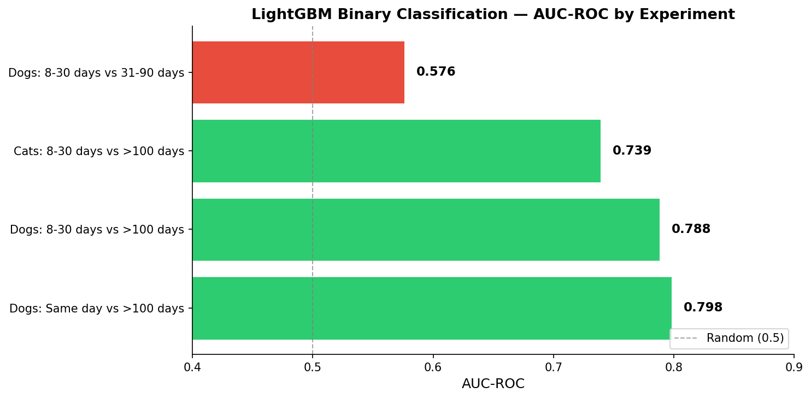
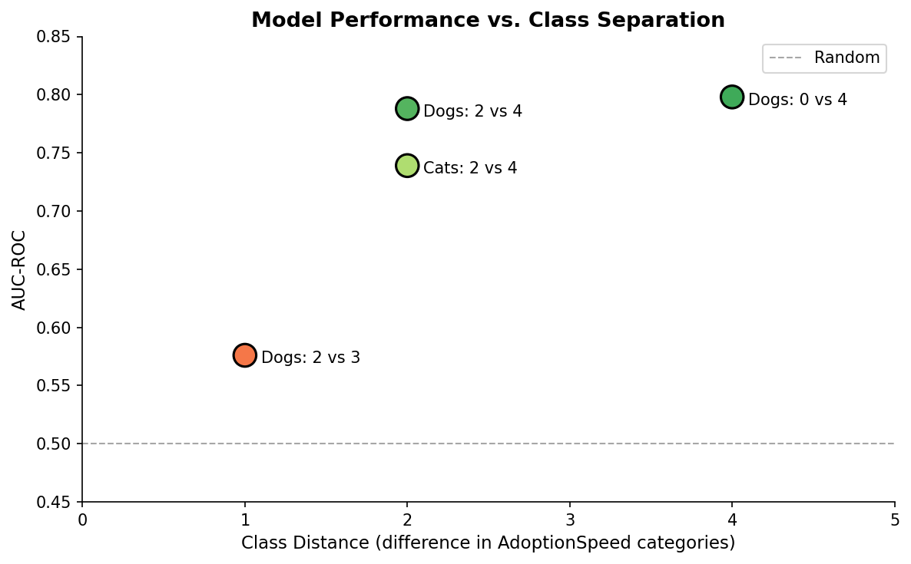
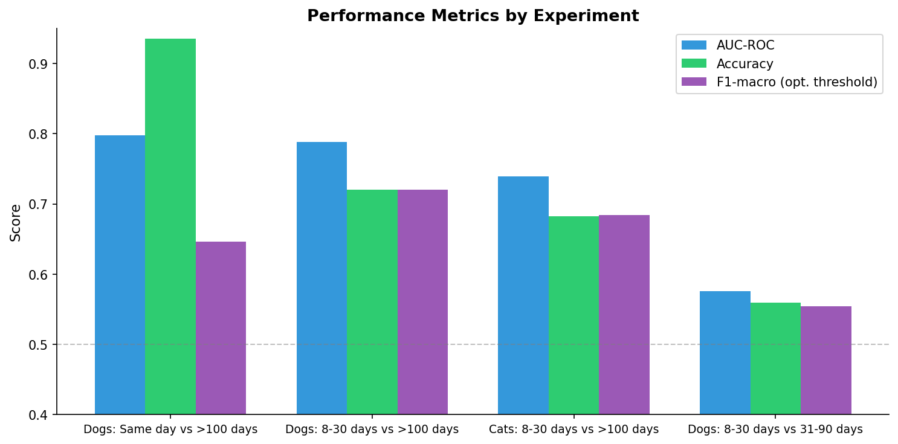

# Experiment Results — LightGBM Binary Classification

## Overview

We validated our tabular feature pipeline by training LightGBM binary classifiers on simplified subsets of the PetFinder adoption speed prediction problem. The goal: confirm that the features carry meaningful signal before tackling the full 5-class problem.

## Results Summary

| Mode | Description | Samples | Balance | AUC-ROC | Accuracy | F1-macro |
|------|-------------|---------|---------|---------|----------|----------|
| `dogs_extreme` | Dogs: Same day vs >100 days | 2,584 | 170 vs 2,414 | **0.798** | 0.935 | 0.646 |
| `dogs_month_vs_100` | Dogs: 8-30 days vs >100 days | 4,578 | 2,164 vs 2,414 | **0.788** | 0.720 | 0.720 |
| `cats_month_vs_100` | Cats: 8-30 days vs >100 days | 3,656 | 1,873 vs 1,783 | **0.739** | 0.682 | 0.684 |
| `dogs_adjacent` | Dogs: 8-30 days vs 31-90 days | 4,113 | 2,164 vs 1,949 | **0.576** | 0.559 | 0.554 |

## Visualizations

### AUC-ROC Comparison



### Performance vs. Class Distance



### All Metrics by Experiment



## Key Findings

1. **Strong signal for distant classes**: When comparing pets adopted quickly (same day or within a month) vs. pets not adopted after 100+ days, the model achieves AUC ~0.79–0.80. This confirms the tabular features (age, breed, vaccination, photos, sentiment, etc.) carry real predictive signal.

2. **Cats are slightly harder to predict** than dogs (AUC 0.74 vs 0.79 for the same class comparison). This may be because cat adoption depends more on subjective factors (photo quality, personality description) not captured well in structured data.

3. **Adjacent classes are nearly indistinguishable**: Trying to separate "8-30 days" from "31-90 days" gives AUC 0.58 — barely above random (0.50). This tells us the main challenge in the full 5-class problem is separating the middle categories.

4. **Class imbalance matters**: The `dogs_extreme` experiment (170 vs 2414) achieves high AUC but poor F1-macro at default threshold. Optimal threshold search improved F1-macro from 0.50 → 0.65.

5. **Breed PCA is effective**: Reducing 241 dog breeds → 15 PCA components retains 79% of variance; 66 cat breeds → 15 components retains 92%.

## Technical Details

- **Model**: LightGBM (gradient boosting)
- **Evaluation**: 5-fold stratified cross-validation
- **Metric**: AUC-ROC (threshold-independent ranking quality)
- **Features**: 73 total (numeric, OHE categorical, sentiment, image metadata, breed PCA)
- **Hyperparameters**: Default + Optuna tuning (20 trials for dogs_extreme)

## How to Reproduce

```bash
# Preprocess any mode
python -m src.preprocessing --mode dogs_month_vs_100 --force

# Train and evaluate
python -m src.lgbm --mode dogs_month_vs_100 --force

# With hyperparameter tuning
python -m src.lgbm --mode dogs_month_vs_100 --tune --n-trials 20

# Generate plots
python -m src.results_summary
```

## Available Modes

```
all_multiclass      — All pets, 5 classes (original competition task)
dogs_extreme        — Dogs: same day (0) vs >100 days (4)
dogs_month_vs_100   — Dogs: 8-30 days (2) vs >100 days (4)
dogs_adjacent       — Dogs: 8-30 days (2) vs 31-90 days (3)
cats_month_vs_100   — Cats: 8-30 days (2) vs >100 days (4)